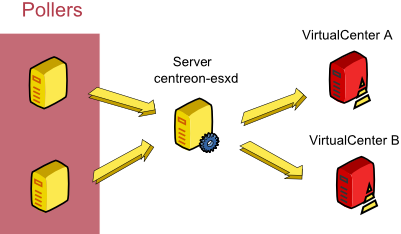

============
Exploitation
============

Generals Principles
-------------------

Centreon-esxd is a Perl program in charged to get back VMWare indicators. This program uses the SDK Perl provided by VMWare in order to connect and get back the informations of one (or more) Virtual Center. To do this, it makes a TCP connection with the VirtualCenter.

By default "centreon-esxd" starts at least two processes (named "handle-client" and "handle-vsphere-xxxx") :

*« handle-client »*:
  *Process waiting for requests of "centron-esx-client.pl" clients.*

Steps of operation :

- A client connects.
- The client ask an monitoring indicator on a VirtualCenter.
- The process "handle-client" sends the request to process "handle-vsphere-xxxx".
- A response is sent by "handle-vsphere-xxxx" to "handle-client".
- The process "handle-client" sends the response to the client.

*« handle-vsphere-xxxx »*:
  *Process responsible to connect and to keep opened a session with the VirtualCenter. To ensure quality performance, a cache of datas description is created.*

Then, this process gets back the VMWare indicators creating a subprocess per request.

Centreon-esxd necessitates the utilization of one (or more) VirtualCenter (or ESX).
This is a example of a distributed architecture :

Operating mode
--------------

The "centreon-esxd" program only works in "daemon" mode (a client is needed).

Connector configuration
-----------------------

The « centreon-esxd » daemon is configured with the « centreon_esxd.pm » configuration file ::
 
    %centreonesxd_config = (
        vsphere_server => {
                        'default' => {'url' => 'https://vcenter/sdk',
                                     'username' => 'test@test.fr',
                                     'password' => 'xxxx'},
                        }
    );

« vsphere_server » attribute configures VirtualCenter access.
In case you have many VirtualCenters, the configuration is (note the use of "," as a separator) ::

    %centreonesxd_config = (
        vsphere_server => {
                        'default' => {'url' => 'https://vcenter/sdk',
                                     'username' => 'test@test.fr',
                                     'password' => 'xxxx'},
                        },
                        'other' => {'url' => 'https://other_vcenter/sdk',
                                     'username' => 'test@test.fr',
                                     'password' => 'xxxx'},
                        }
    );

Troubleshooting
---------------

It is possible to get this kind of errors in the « logs » of « centreon-esxd » ::

    ...SOAP request error - possibly a protocol issue: read failed: error:1408F119:SSL routines:SSL3_GET_RECORD:decryption failed or bad record mac...

VMWare Perl SDK sometimes generates this error that does not alter the behaviour of the connector.

It is necessary to create an incident in case there are too many connections error between the daemon and the VirtualCenter.

