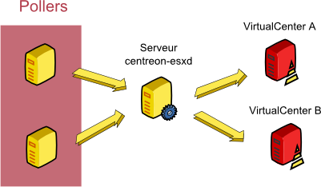

============
Exploitation
============

Principes Généraux
------------------

Centreon-esxd est un programme Perl chargé de récupérer des indicateurs VMWare. Ce programme utilise le SDK Perl fourni par VMWare afin de se connecter et récupérer les informations d'un (ou plusieurs) VirtualCenter. Pour cela il effectue une connexion TCP avec le(s) VirtualCenter.

Par défaut, « centreon-esxd » lance au moins deux processus (nommé respectivement « handle-client », « handle-vsphere-xxxx ») :

*« handle-client »*:
  *Processus en attente des demandes des clients « centreon_esx_client.pl ».*

Voici le fonctionnement :

- Un client se connecte.
- Le client demande un indicateur de supervision sur un VirtualCenter.
- Le processus « handle-client » fourni cette demande au processus « handle-vsphere-xxxx ».
- Une réponse est fournie par « handle-vsphere-xxxx » à « handle-client ».
- Le processus « handle-client » fourni la réponse au client.

*« handle-vsphere-xxxx »*:
  *Processus ayant le rôle de se connecter et garder ouverte une session avec son VirtualCenter (De plus, dans un souci de performances, un cache de description des données de performances est créé).* 

Enfin, ce processus récupère les indicateurs VMWare en créant un sous-processus par demande.

Centreon-esxd nécessite impérativement l'utilisation d'un (ou plusieurs) VirtualCenter (ou ESX).

Voici un exemple d'architecture éclaté :

Mode de fonctionnement
----------------------

Le programme « centreon-esxd » fonctionne uniquement en mode « daemon ». (dans le sens où il ne peut fournir les indicateurs sans l'utilisation d'un client).

Configuration du connecteur
---------------------------

Le daemon « centreon-esxd » possède un fichier de configuration « centreon_esxd.pm » de la forme suivante ::
 
    %centreonesxd_config = (
        vsphere_server => {
                        'default' => {'url' => 'https://vcenter/sdk',
                                     'username' => 'test@test.fr',
                                     'password' => 'xxxx'},
                        }
    );

L'attribut « vsphere_server » permet de configurer les accès aux différents VirtualCenter.
Dans le cas ou il y a plusieurs VirtualCenters, la configuration devient (noter la "," de séparation) ::

    %centreonesxd_config = (
        vsphere_server => {
                        'default' => {'url' => 'https://vcenter/sdk',
                                     'username' => 'test@test.fr',
                                     'password' => 'xxxx'},
                        },
                        'other' => {'url' => 'https://other_vcenter/sdk',
                                     'username' => 'test@test.fr',
                                     'password' => 'xxxx'},
                        }
    );

Troubleshooting
---------------

Il est possible de retrouver des erreurs de ce type dans les « logs » de « centreon-esxd » ::

    ...SOAP request error - possibly a protocol issue: read failed: error:1408F119:SSL routines:SSL3_GET_RECORD:decryption failed or bad record mac...

Le SDK Perl VMWare génère cette erreur de temps en temps mais ne bloque pas le fonctionnement du connecteur.

Il est nécessaire de remonter un problème dans le cas d'un trop grand nombres de déconnexion du daemon au VirtualCenter.

