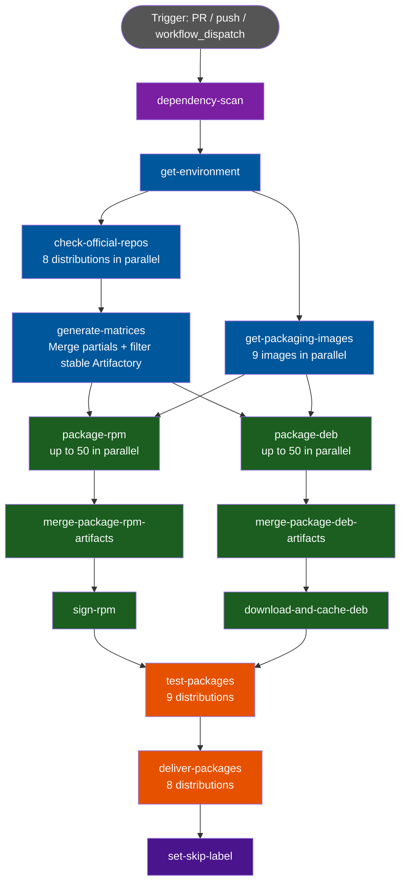
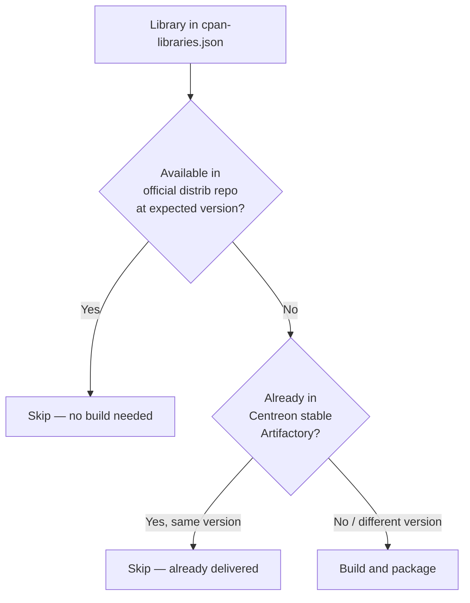

# Perl CPAN Libraries CI/CD pipeline

## Purpose

Some Perl modules required by the plugins are not available in the official package repositories of supported Linux distributions (AlmaLinux, Debian, Ubuntu). The `perl-cpan-libraries` workflow builds and delivers these missing libraries as native `.rpm` and `.deb` packages so they can be installed as standard system packages alongside the plugins.

The pipeline is **smart**: before building anything, it checks whether a library is already available in the distribution's official repositories or in the Centreon stable Artifactory repository. Only libraries that are genuinely missing or at the wrong version are packaged.

---

## Overview



---

## Trigger conditions

| Event | Condition | Description |
|---|---|---|
| `pull_request` | Changes to `.github/workflows/perl-cpan-libraries.yml` only | Triggered when the workflow itself is modified |
| `push` | Branches `develop`, `dev-YY.MM.x`, `master`, `YY.MM.x` + same path | Triggered after merging a change to the workflow file |
| `workflow_dispatch` | Manual trigger (no inputs required) | Manual run at any time |

> **Important:** Unlike the plugins pipeline, this workflow does **not** trigger on changes to `src/**`, `packaging/**`, or `tests/**`. It only triggers when the workflow definition itself changes, or when launched manually. To add or update a library, modify `cpan-libraries.json` and trigger manually (or include the workflow file change in the same PR).

### Concurrency

One run per branch at a time; in-progress runs are cancelled when a new run starts on the same branch.

---

## Library catalogue: `cpan-libraries.json`

The single source of truth for all CPAN libraries to manage is `.github/packaging/cpan-libraries.json`. Each entry describes one CPAN module and its packaging configuration:

```json
{
  "libraries": [
    {
      "name": "Crypt::OpenSSL::AES",
      "rpm": {
        "build_distribs": "el8,el9"
      },
      "deb": {
        "build_names": "bullseye-amd64,bookworm,trixie,jammy,noble,bullseye-arm64",
        "use_dh_make_perl": "false",
        "no-auto-depends": "true",
        "deb_dependencies": "libexporter-tiny-perl libxs-install-perl"
      }
    }
  ]
}
```

### Key fields

| Field | Scope | Description |
|---|---|---|
| `name` | Both | CPAN module name (e.g. `Net::SNMP`) |
| `rpm.build_distribs` | RPM | Comma-separated list of distributions to build for. Default: all RPM distribs (`el8,el9,el10`) |
| `rpm.version` | RPM | Pin to a specific version. If absent, uses the latest from CPAN |
| `rpm.rpm_dependencies` | RPM | Extra RPM dependencies |
| `rpm.rpm_provides` | RPM | Additional `Provides:` entries in the spec file |
| `rpm.no-auto-depends` | RPM | Disable automatic dependency detection |
| `rpm.preinstall_cpanlibs` | RPM | CPAN modules to install before building (e.g. build tools) |
| `rpm.preinstall_packages` | RPM | System packages to install before building |
| `rpm.revision` | RPM | Package release revision (default: `1`) |
| `rpm.spec_file` | RPM | Path to a custom `.spec` file, bypassing the automatic build script |
| `deb.build_names` | DEB | Comma-separated build targets. Default: all DEB distribs |
| `deb.use_dh_make_perl` | DEB | `"true"` to use `dh-make-perl` instead of `fpm` |
| `deb.deb_dependencies` | DEB | Extra DEB dependencies |
| `deb.deb_provides` | DEB | Additional `Provides:` entries |
| `deb.no-auto-depends` | DEB | Disable automatic dependency detection |
| `deb.preinstall_cpanlibs` | DEB | CPAN modules to install before building |
| `deb.preinstall_packages` | DEB | System packages to install before building |
| `deb.revision` | DEB | Package release revision |

A library with only an `rpm` key is built for RPM distributions only, and vice versa.

---

## Intelligent filtering

The pipeline avoids unnecessary builds through a two-level filtering process:



### Level 1 — Official repository check (`check-official-repos`)

Runs inside the actual distribution container (e.g. `debian:bookworm`) using the real package manager:
- **RPM**: queries `dnf` with EPEL + CRB/Powertools enabled
- **DEB**: queries `apt-get` after `apt-get update`

Uses `cpanminus` to resolve the CPAN distribution name and version for each module. Produces a `partial-matrix-{distrib}.json` file listing only the libraries that need to be built for that distribution.

### Level 2 — Centreon stable Artifactory check (`generate-matrices`)

After collecting all partial matrices, `generate-matrices.py` additionally queries the Centreon public Artifactory instance (`packages.centreon.com`) for each library. If the package is already present in the stable repository at the expected version, it is excluded from the build matrix.

This prevents redundant rebuilds when re-running the workflow on a branch where no library actually changed.

---

## Jobs description

### `dependency-scan`

Runs the `centreon/security-tools` dependency vulnerability scan.

### `get-environment`

Determines stability, version, release, and skip status. See the [plugins CI documentation](plugins-ci.md#get-environment) for details — the logic is identical.

**Skipped entirely if** `stability == 'stable'` (no packaging on stable).

### `check-official-repos`

Runs in parallel on 8 distributions, each inside the official Docker image for that distribution (e.g. `almalinux:9`, `debian:bookworm`).

For each distribution:
1. Installs `python3` and `cpanminus` via the system package manager.
2. Enables EPEL and CRB/Powertools for RPM distributions.
3. Runs `check-official-repos.py` which:
   - Filters the library catalogue to only the libs relevant for this distribution.
   - Calls `cpanm --info` for each library to get the CPAN distribution name and latest version.
   - Calls the package manager to check whether the library (or its distrib-packaged equivalent) is already available at the right version.
   - Produces `official-repos/partial-matrix-{distrib}.json`.
4. Uploads the partial matrix as a GitHub Actions artifact.

### `get-packaging-images`

In parallel with `check-official-repos`, pulls the 9 internal Docker packaging images from the Centreon Harbor registry and saves them to the GitHub Actions cache.

Images pulled: `packaging-plugins-alma8/9/10`, `packaging-plugins-bullseye` (amd64 + arm64), `packaging-plugins-bookworm`, `packaging-plugins-trixie`, `packaging-plugins-jammy`, `packaging-plugins-noble`.

These images contain the tools needed to build packages (rpmbuild, fpm, dh-make-perl, etc.) with all required development headers pre-installed.

### `generate-matrices`

1. Downloads all `partial-matrix-*.json` artifacts.
2. Optionally queries the Centreon stable Artifactory repository to exclude already-delivered packages.
3. Generates two flat `include`-only matrices (no cross-product):
   - `matrix_rpm`: one entry per (library, RPM distrib) combination that needs building
   - `matrix_deb`: one entry per (library, DEB build target) combination that needs building
4. Deletes the partial matrix artifacts (cleanup).

Each matrix entry carries all the parameters needed to build the package: `name`, `distrib`, `image`, `version`, `rpm_dependencies`, `deb_dependencies`, `use_dh_make_perl`, etc.

### `package-rpm`

Builds RPM packages. Up to 50 jobs run in parallel, one per (library, distrib) entry in `matrix_rpm`.

For each entry, inside the packaging Docker container:

**Standard mode** (no `spec_file`): runs `package-cpan-rpm.sh` which:
1. Optionally installs pre-required CPAN modules (`preinstall_cpanlibs`) and system packages.
2. Downloads and builds the module from CPAN using `cpanm`.
3. Packages the result as an RPM using `cpanspec` and `rpmbuild`.

**Custom spec file mode** (`spec_file` set): runs `rpmbuild` directly with the provided spec file (for libraries that require complex build steps).

Output: one `.rpm` file per entry, uploaded as an individual artifact.

### `merge-package-rpm-artifacts`

Merges all individual RPM artifacts into one artifact per distribution (`packages-rpm-el8`, `packages-rpm-el9`, `packages-rpm-el10`) for easier downstream consumption, then deletes the individual artifacts.

### `sign-rpm`

Signs all `.rpm` files for each distribution using the Centreon GPG signing key. Runs sequentially (max-parallel: 1) inside a dedicated signing container.

Saves signed RPMs to cache with key `{sha}-{run_id}-rpm-{distrib}`.

### `package-deb`

Builds DEB packages. Up to 50 jobs run in parallel, one per (library, DEB build target) entry in `matrix_deb`. Supports two packaging methods:

**Method 1 — fpm** (`use_dh_make_perl: "false"`, default):
Runs `package-cpan-deb-fpm.sh` which installs the module via `cpanm` and then repackages it as a `.deb` using `fpm`. Gives full control over dependencies (`deb_dependencies`) and metadata.

**Method 2 — dh-make-perl** (`use_dh_make_perl: "true"`):
Runs `package-cpan-deb-dhmaker.sh` which uses `dh-make-perl` to automatically generate a proper Debian package following Debian packaging conventions. Used for libraries that need strict Debian-style packaging.

Output: one `.deb` file per entry, uploaded as an individual artifact.

### `merge-package-deb-artifacts`

Same as the RPM equivalent: merges individual DEB artifacts into one per distribution, then deletes the individual artifacts.

### `download-and-cache-deb`

Downloads the merged DEB artifacts and saves them to the GitHub Actions cache with key `{sha}-{run_id}-deb-{distrib}`.

### `test-packages`

Installs and tests all packaged libraries on the 9 supported distributions (using official images, not internal ones). Runs in matrix across:

| Distribution | Format | Architecture |
|---|---|---|
| el8 | RPM | amd64 |
| el9 | RPM | amd64 |
| el10 | RPM | amd64 |
| bullseye | DEB | amd64 + arm64 |
| bookworm | DEB | amd64 |
| trixie | DEB | amd64 |
| jammy | DEB | amd64 |
| noble | DEB | amd64 |

Uses the `.github/actions/test-cpan-libs` action, which installs all packages for the distribution and verifies they load correctly via `perl -e "use Module::Name"`.

On failure, an error log artifact is uploaded as `install_error_log_{distrib}-{arch}`.

### `deliver-packages`

Uploads all packages to the Centreon Artifactory repository under the `perl-cpan-libraries` module name.

**Conditions:**
- `stability` is `testing` or `unstable`, **OR** `stability == 'stable'` with a `push` event (not `workflow_dispatch`)
- All previous jobs succeeded

### `set-skip-label`

Adds the label `skip-workflow-perl-cpan-libraries` to the PR after successful delivery, to avoid re-running if no relevant changes are detected on the next push.

---

## Cache usage summary

| Key | Content | Produced by | Consumed by |
|---|---|---|---|
| `{image}-{sha}-{run_id}` | Docker image tar | `get-packaging-images` | `package-rpm`, `package-deb` |
| `{sha}-{run_id}-rpm-{distrib}` | Signed `.rpm` files | `sign-rpm` | `test-packages`, `deliver-packages` |
| `{sha}-{run_id}-deb-{distrib}` | `.deb` files | `download-and-cache-deb` | `test-packages`, `deliver-packages` |

---

## Supported distributions

| Distribution | OS | Format | Built by |
|---|---|---|---|
| el8 | AlmaLinux 8 | RPM | `package-rpm` |
| el9 | AlmaLinux 9 | RPM | `package-rpm` |
| el10 | AlmaLinux 10 | RPM | `package-rpm` |
| bullseye (amd64) | Debian 11 | DEB | `package-deb` |
| bullseye (arm64) | Debian 11 | DEB | `package-deb` |
| bookworm | Debian 12 | DEB | `package-deb` |
| trixie | Debian 13 | DEB | `package-deb` |
| jammy | Ubuntu 22.04 | DEB | `package-deb` |
| noble | Ubuntu 24.04 | DEB | `package-deb` |

---

## Adding a new CPAN library

1. Edit `.github/packaging/cpan-libraries.json` and add a new entry:
   ```json
   {
     "name": "My::New::Module",
     "rpm": {},
     "deb": {}
   }
   ```
   Empty `rpm` and `deb` objects use all defaults (build for all distributions, latest CPAN version, automatic dependency detection).

2. Trigger the workflow manually via `workflow_dispatch`, or include the `cpan-libraries.json` change in a PR that also modifies the workflow file.

3. The CI will check official repositories first. If the module is already packaged there, nothing will be built and the workflow completes successfully.

4. If the module is missing from official repos, it will be packaged, tested, and delivered automatically.

> **Tip:** For complex modules (XS/C extensions, unusual build systems), use `preinstall_cpanlibs`, `preinstall_packages`, or provide a custom `spec_file`. Refer to existing entries in `cpan-libraries.json` for examples.

---

## Key differences from the plugins pipeline

| Aspect | `plugins.yml` | `perl-cpan-libraries.yml` |
|---|---|---|
| Trigger paths | `src/**`, `packaging/**`, `tests/**` | `.github/workflows/perl-cpan-libraries.yml` only |
| Change detection | Per-plugin (`plugins.json`) | Global (all libraries re-evaluated) |
| Build filtering | All modified plugins | Official repo check + stable Artifactory check |
| Packaging tool | App::FatPacker + nfpm | cpanm + rpmbuild/fpm/dh-make-perl |
| DEB signing | Via nfpm | Not signed (DEB packages are not GPG-signed) |
| RPM signing | Via nfpm | Dedicated `sign-rpm` job |
| Test method | Install + Robot Framework / `--help` | Install + `perl -e "use Module"` |
