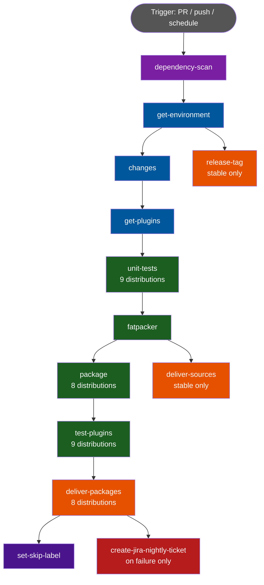
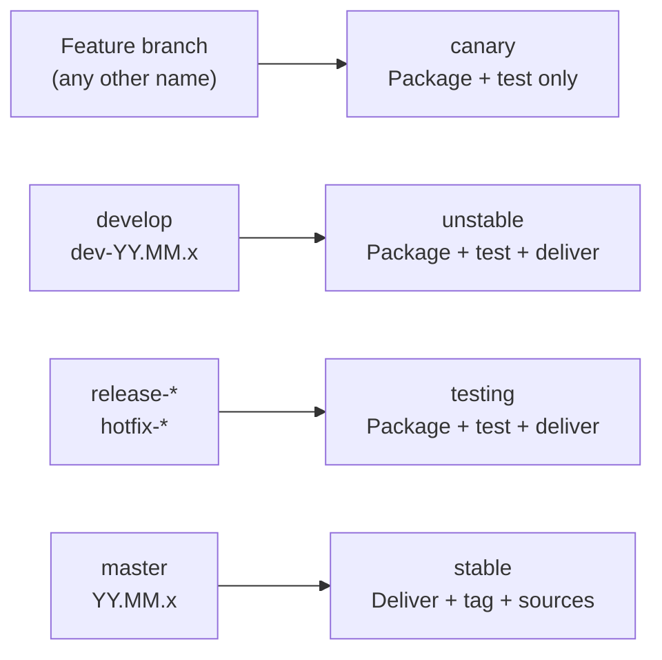
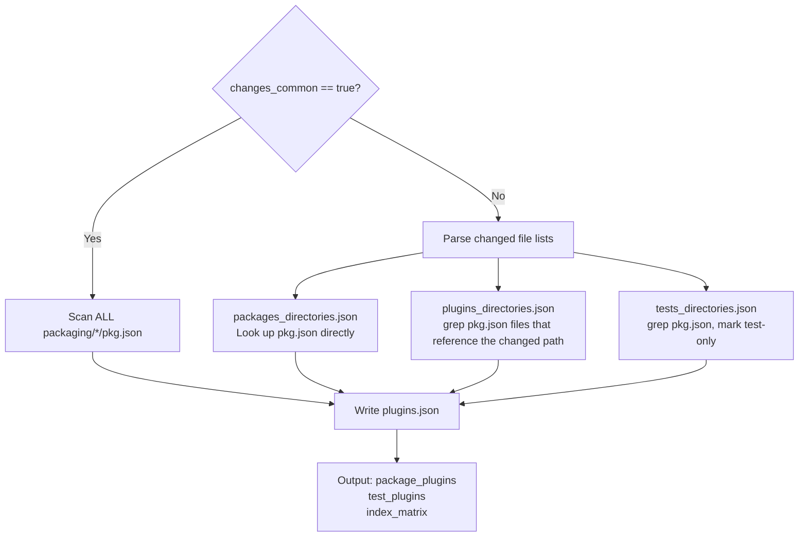
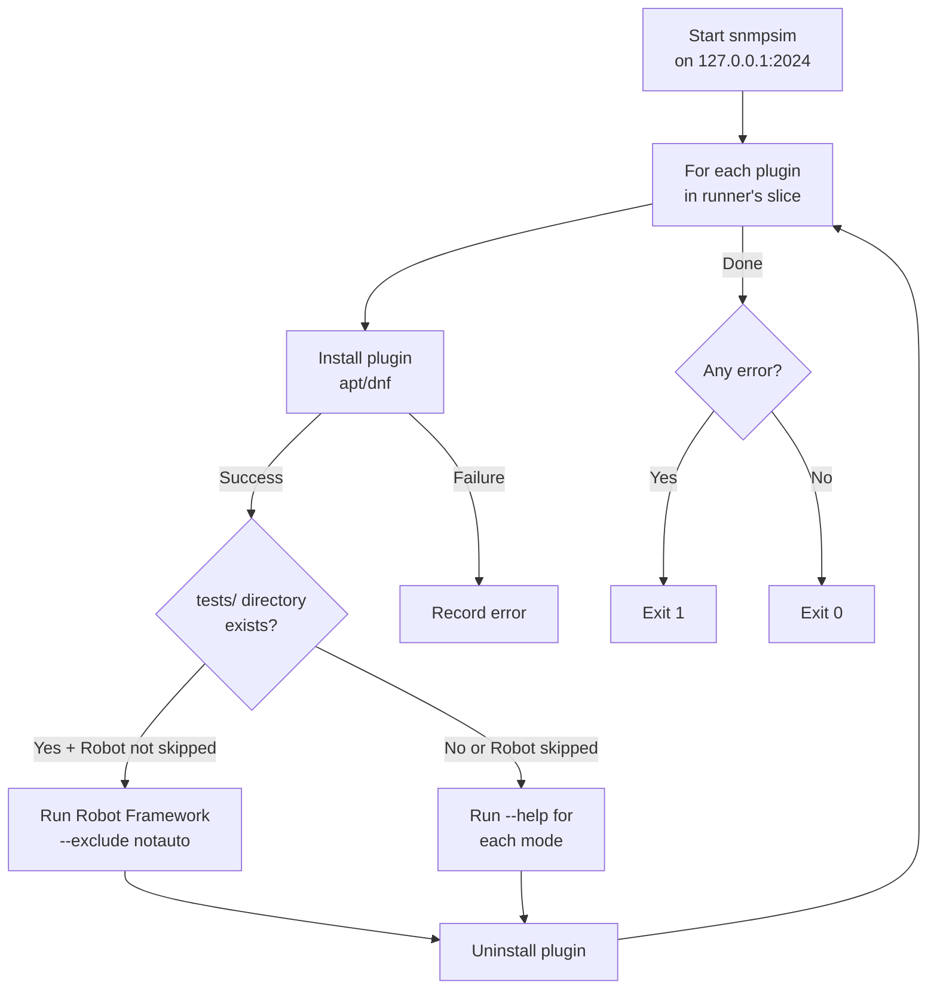
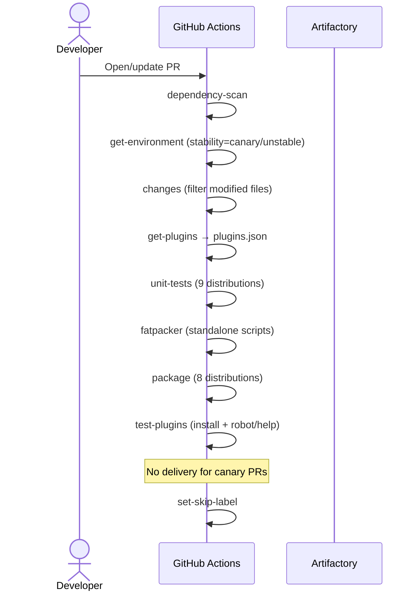
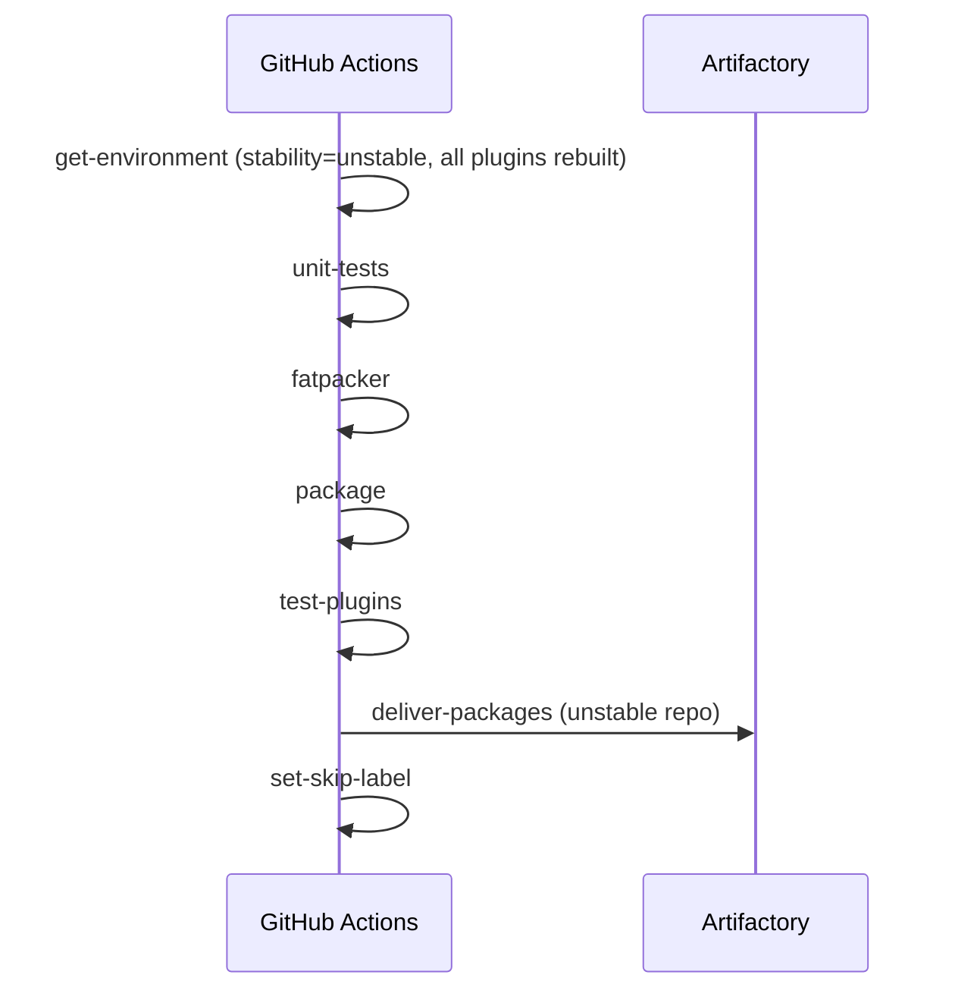
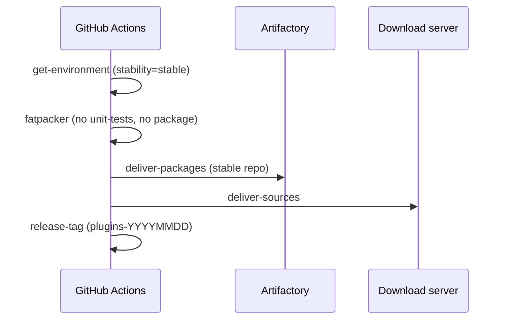

# Plugins CI/CD pipeline

## Overview

The plugins CI/CD pipeline is defined in `.github/workflows/plugins.yml` and automates the entire lifecycle of a plugin change: detection, unit testing, packaging, integration testing, and delivery to the Centreon repositories.



---

## Trigger conditions

The pipeline starts in the following cases:

| Event | Condition | Description |
|---|---|---|
| `pull_request` | Files matching the paths filter (see below) | Triggered on any PR that modifies relevant files |
| `push` | Branches `develop` or `master` + matching paths | Triggered after merging a PR to `develop` or `master` |
| `schedule` | Every Monday at 01:30 UTC (`30 1 * * 1`) | Weekly nightly run |
| `workflow_dispatch` | Manual trigger with `nightly_manual_trigger = true` | Manual nightly run |

### Path filter

The CI only triggers if at least one of the following paths is affected:

```
.github/workflows/plugins.yml
.github/workflows/plugins-robot-tests.yml
.github/scripts/list-plugins-to-build-and-test.py
.github/scripts/prepare-package-plugins.sh
.github/scripts/fatpack-plugins.pl
.github/scripts/test-plugins.py
.github/packaging/centreon-plugin.yaml.template
src/**
packaging/**
tests/**
```

### Concurrency

Only one run per branch is active at a time. If a new run starts on the same branch, the in-progress run is automatically cancelled (`cancel-in-progress: true`).

---

## Stability levels

The branch name determines the stability level, which drives what actions are performed:



| Stability | Branches | Version format | Package delivered |
|---|---|---|---|
| `canary` | Any feature branch | `YYYYMM00` | No |
| `unstable` | `develop`, `dev-YY.MM.x` | `YYYYMMDD` (current date) | Yes (unstable repo) |
| `testing` | `release-YYYYMMDD`, `hotfix-YYYYMMDD` | Date from branch name | Yes (testing repo) |
| `stable` | `master`, `YY.MM.x` | From `.version.plugins` file | Yes (stable repo) |

---

## Skip-workflow mechanism

A PR can carry the label `skip-workflow-plugins`. When this label is present:

1. `get-environment` checks whether the last push modified any relevant files.
2. If no relevant files changed, `skip_workflow=true` is set and the entire pipeline exits early.
3. If relevant files are detected, the label is automatically removed and the pipeline continues normally.

This allows a PR to skip unnecessary re-runs when only non-functional changes (documentation, etc.) are pushed.

---

## Jobs description

### `dependency-scan`

Runs an external security workflow (`centreon/security-tools`) to scan project dependencies for known vulnerabilities.

### `get-environment`

Determines the build context for the current run. Outputs used by all downstream jobs:

| Output | Description |
|---|---|
| `version` | Package version (`YYYYMMDD` for unstable, date from branch for testing, from `.version.plugins` for stable) |
| `release` | Package release (`1` for testing/unstable, Unix timestamp for others) |
| `stability` | `canary`, `unstable`, `testing`, or `stable` |
| `is_nightly` | `true` when triggered by schedule or manual nightly dispatch |
| `skip_workflow` | `true` when the skip label is present and no relevant files changed |

### `changes`

Only active on pull requests targeting `testing`, `unstable`, or `canary` stability branches.

Uses `dorny/paths-filter` to identify which categories of files changed:

- `common`: changes in `src/centreon/**` or the packaging template
- `packages`: new or modified files in `packaging/**`
- `plugins`: new or modified files in `src/**`
- `tests`: new or modified files in `tests/**`

> **Note:** On `push` events (merges to `develop`/`master`), `changes_common` defaults to `true`, meaning all plugins are rebuilt.

### `get-plugins`

Determines the list of plugins to build and/or test, and writes it to `plugins.json`.



Each entry in `plugins.json` contains:

```json
{
  "centreon-plugin-Network-Foo-Bar": {
    "perl_package": "network::foo::bar::snmp::plugin",
    "command": "centreon_foo_bar_snmp.pl",
    "paths": ["network/foo/bar/snmp"],
    "build": true,
    "test": true,
    "runner_id": 3,
    "test_dependencies": []
  }
}
```

The `runner_id` distributes plugins across up to 25 parallel test runners (`max_testing_jobs`).

The resulting `plugins.json` is saved to the GitHub Actions cache with key `plugins-{sha}-{run_id}`.

> **Tip:** Add the label `upload-artifacts` to a PR to get `plugins.json` as a downloadable artifact.

### `unit-tests`

Runs Perl unit tests against all supported distributions in parallel (max 3 at a time).

**Skipped if:** `stability == 'stable'`

| Image | Distribution | Architecture |
|---|---|---|
| `unit-tests-alma8` | el8 (AlmaLinux 8) | amd64 |
| `unit-tests-alma9` | el9 (AlmaLinux 9) | amd64 |
| `unit-tests-alma10` | el10 (AlmaLinux 10) | amd64 |
| `unit-tests-bullseye` | Debian 11 | amd64 |
| `unit-tests-bullseye-arm64` | Debian 11 | arm64 |
| `unit-tests-bookworm` | Debian 12 | amd64 |
| `unit-tests-trixie` | Debian 13 | amd64 |
| `unit-tests-jammy` | Ubuntu 22.04 | amd64 |
| `unit-tests-noble` | Ubuntu 24.04 | amd64 |

On failure, the file `lastlog.jsonl` is uploaded as an artifact.

### `fatpacker`

Produces standalone Perl scripts (one per plugin) by bundling all dependencies into a single executable file using [App::FatPacker](https://metacpan.org/pod/App::FatPacker).

**Requires:** `package_plugins == 'True'` (at least one plugin to build)

Steps:
1. Restores `plugins.json` from cache.
2. Sets `$global_version` and `$alternative_fatpacker` flags in `src/centreon/plugins/script.pm`.
3. For each plugin in `plugins.json` where `build == true`:
   - Copies common framework files + plugin-specific files into a `lib/` directory.
   - Strips `__END__` blocks (Centreon Connector Perl compatibility).
   - Runs `App::FatPacker->fatpack_file("centreon_plugins.pl")`.
   - Outputs a standalone executable to `build/<plugin_name>/<plugin_command>`.
4. Saves the `build/` directory to cache with key `fatpacked-plugins-{sha}-{run_id}`.

### `package`

Builds `.rpm` and `.deb` packages for all supported distributions (max 5 in parallel).

**Skipped if:** `stability == 'stable'`

Uses internal Docker images from the Centreon Harbor registry. For each distribution:
1. Restores `build/` (fatpacked plugins) and `plugins.json` from cache.
2. Runs `prepare-package-plugins.sh` to generate `nfpm`-compatible YAML descriptors from the template.
3. Runs the `package-nfpm` action to build and GPG-sign the packages.
4. Saves packages to cache with key `{sha}-{run_id}-{extension}-{distrib}`.

Supported distributions:

| Distrib | Format |
|---|---|
| el8 | RPM |
| el9 | RPM |
| el10 | RPM |
| bullseye | DEB |
| bookworm | DEB |
| trixie | DEB |
| jammy | DEB |
| noble | DEB |

### `test-plugins`

Installs, tests, and removes each plugin on all supported distributions. This job calls the reusable workflow `.github/workflows/plugins-robot-tests.yml`.

**Skipped if:** `stability == 'stable'` or `test_plugins != 'True'`

The test matrix is identical to the package matrix, plus `bullseye-arm64`. Up to 25 runners are used in parallel (controlled by `index_matrix`).

For each runner/distrib combination:
1. The Docker image is pulled and cached.
2. Packages and `plugins.json` are restored from cache.
3. `test-plugins.py` is executed inside the container:



> **Note:** For `el10` and `trixie`, Robot Framework tests are skipped (`skip_robot_tests: true`) and only the `--help` check is performed. This is temporary while Robot Framework support is being added for these distributions.

On failure, logs and Robot reports are uploaded as artifacts named `test-plugins-log-{distrib}-{arch}-{index}`.

### `deliver-packages`

Uploads packages to the Centreon Artifactory repository.

**Conditions:**
- `package_plugins == 'True'`
- `stability` is `testing` or `unstable`, **OR** `stability == 'stable'` with a `push` event (not `workflow_dispatch`)

Uses the `package-delivery` action with the `plugins` module name for each distribution.

### `deliver-sources`

Uploads the fatpacked plugin files to the Centreon download server.

**Conditions:** `stability == 'stable'` AND event is `push`

### `release-tag`

Creates a Git tag in the format `plugins-YYYYMMDD`.

**Conditions:** `stability == 'stable'` AND event is `push`

If the tag already exists, a warning is emitted but the job does not fail.

### `set-skip-label`

After successful delivery, adds the label `skip-workflow-plugins` to the PR. This prevents re-running the full pipeline if no relevant file changes are detected on the next push to the same PR.

### `create-jira-nightly-ticket`

Automatically creates a Jira ticket if a nightly run fails (`is_nightly == 'true'` and first attempt only).

---

## Cache usage summary

| Key | Content | Produced by | Consumed by |
|---|---|---|---|
| `plugins-{sha}-{run_id}` | `plugins.json` | `get-plugins` | `fatpacker`, `package`, `test-plugins` |
| `fatpacked-plugins-{sha}-{run_id}` | `build/` directory | `fatpacker` | `package`, `deliver-sources` |
| `{sha}-{run_id}-{ext}-{distrib}` | `.rpm` / `.deb` files | `package` | `test-plugins`, `deliver-packages` |
| `{image}-{sha}-{run_id}` | Docker image tar | `test-image-to-cache` | `robot-test` |

---

## Supported distributions summary

| Distribution | OS | Format | Unit tests | Packaging | Testing | Robot tests |
|---|---|---|---|---|---|---|
| el8 | AlmaLinux 8 | RPM | Yes | Yes | Yes | Yes |
| el9 | AlmaLinux 9 | RPM | Yes | Yes | Yes | Yes |
| el10 | AlmaLinux 10 | RPM | Yes | Yes | Yes | No (--help only) |
| bullseye | Debian 11 | DEB | Yes (amd64 + arm64) | Yes | Yes (amd64 + arm64) | Yes |
| bookworm | Debian 12 | DEB | Yes | Yes | Yes | Yes |
| trixie | Debian 13 | DEB | Yes | Yes | Yes | No (--help only) |
| jammy | Ubuntu 22.04 | DEB | Yes | Yes | Yes | Yes |
| noble | Ubuntu 24.04 | DEB | Yes | Yes | Yes | Yes |

---

## Full pipeline flow by event type

### Pull request to `develop` (canary/unstable stability)



### Push to `develop` (unstable stability)



### Push to `master` (stable stability)



---

## Adding a new plugin to the CI

To include a new plugin in the CI pipeline:

1. Create the packaging directory: `packaging/centreon-plugin-<Name>/`
2. Create `pkg.json` with the plugin metadata and file list.
3. Create `rpm.json` and `deb.json` with the Perl dependency lists.
4. Add Robot Framework test files under `tests/<domain>/<vendor>/...`

On the next PR or push, the CI will automatically detect the new `pkg.json` and include the plugin in the build and test cycle.

See `doc/CI.md` for detailed instructions on the packaging file format.
