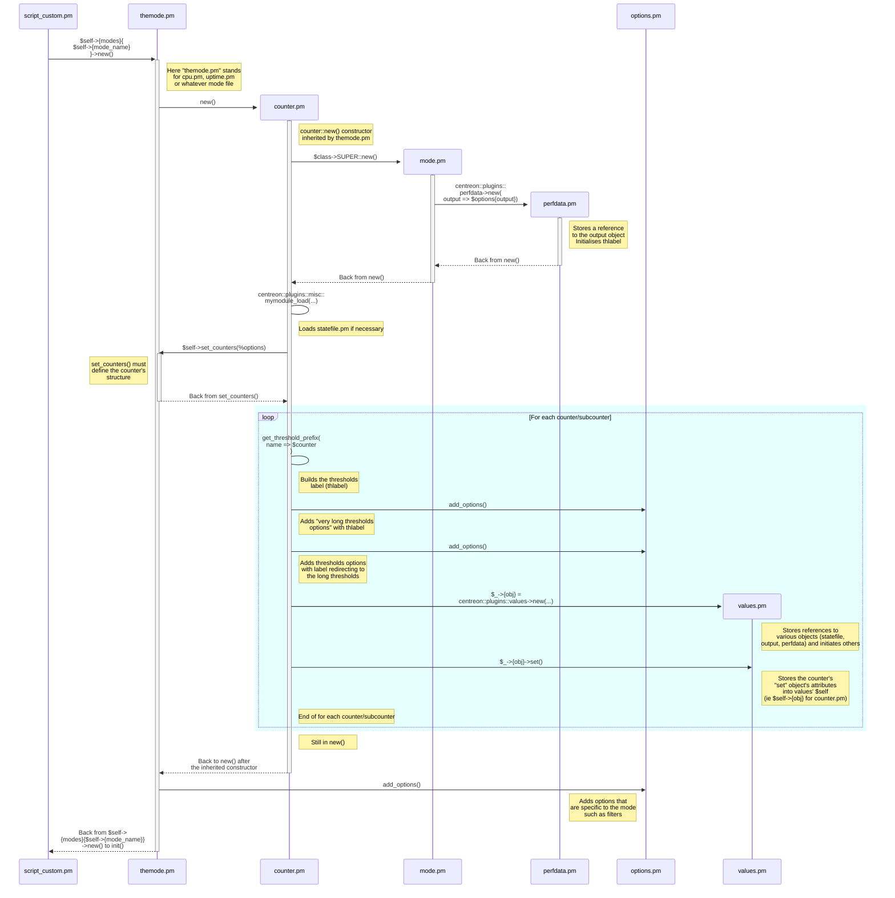
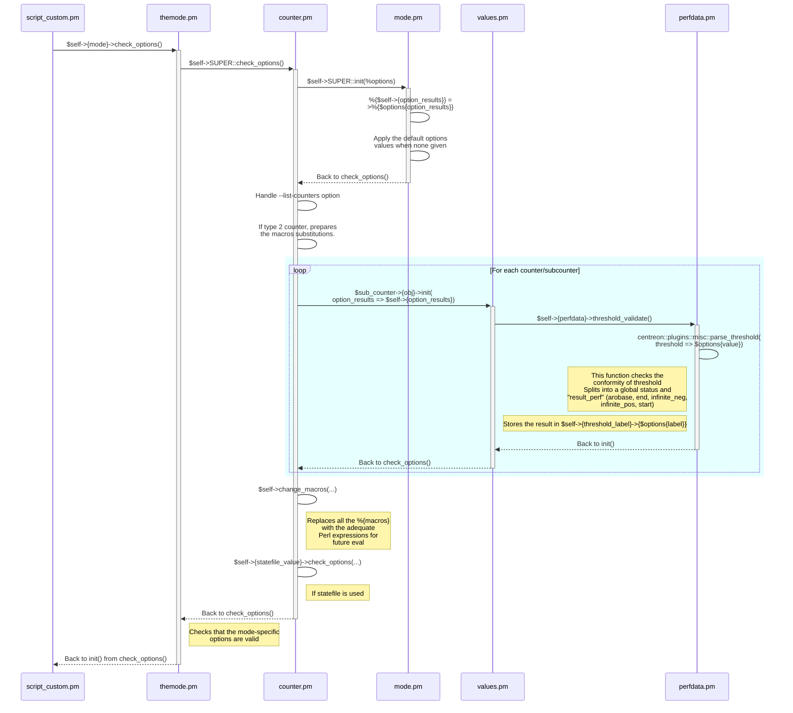
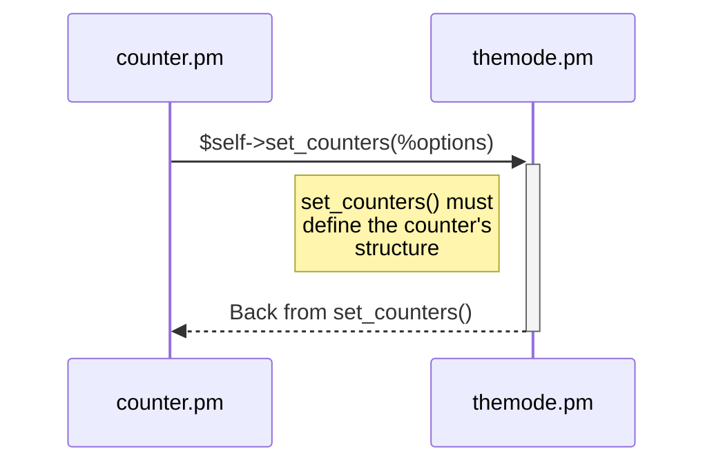
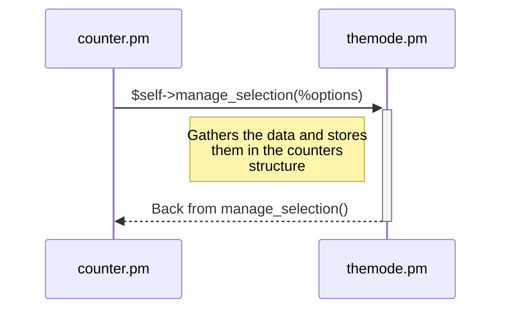
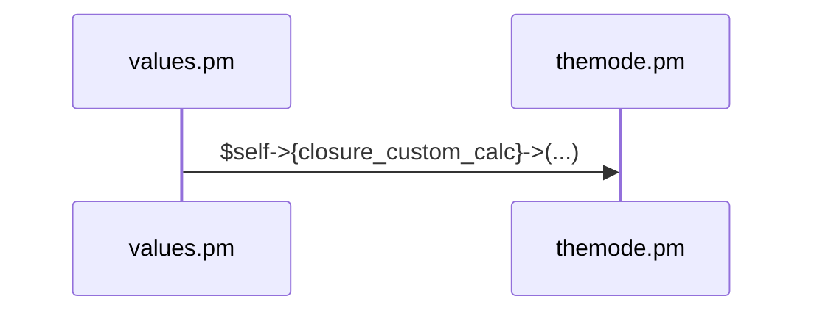
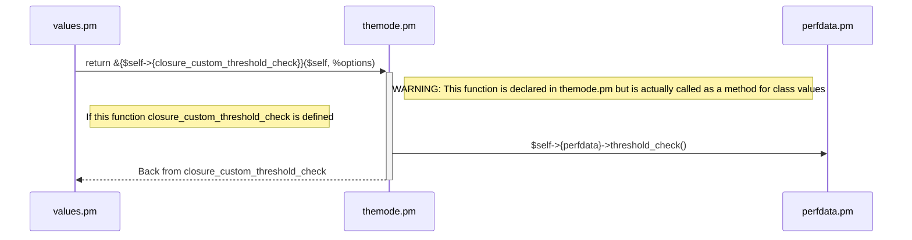

# Centreon Plugins sequence diagram

## Cookbook

The description of the diagram uses the [Mermaid](https://mermaid.js.org/) syntax, which is natively supported by 
Github. You may also check out the file locally and generate the diagram with the following
[mermaid-cli](https://github.com/mermaid-js/mermaid-cli) (`mmdc`) command:

```bash
mmdc -f -i sequence_diagram.mmd -o sequence_diagram.pdf
```

Other output formats such as *png* and *svg* are also available.

## Explanation

### Use case

The provided sequence diagram has been written while debugging this command line:

```bash
perl centreon_plugins.pl --plugin='cloud::azure::database::elasticpool::plugin' --mode='storage'
```

As explained in [plugins_advanced.md](plugins_advanced.md), each mode can use various types of counters, with various
data types and structures. Here, the `maps_counters_type` is of type **3**, which means the most complex case, when 
metrics and statuses are associated to instances organized in groups.
The other types are not explained here, but you may find the keys to understanding them.

### Side notes

In the diagram, almost all the `.pm` files' names are constants in every use case, except for two:
- _plugin.pm_: the name is always the same by convention, but its location depends on what is given as the `--plugin` option
- _themode.pm_: stands for the mode of the plugin that is being used (given as the `--mode` option). For example, cpu.pm, memory.pm... 

### Complete diagram

The complete diagram can be natively displayed by Github [here](sequence_diagram.mmd).

## Interesting parts of the diagram for developers

When you develop a new mode for a plugin, your responsibility will be to provide the necessary functions in _themode.pm_.

### new()

This constructor must call the inherited one (`$class->SUPER::new()`) and then add the options that are specific to this mode.



### check_options()

This method must check that all mandatory options have been given and control they're valid.



### set_counters()

This method will describe how you decide to structure the collected data in order to let the plugins classes (`counter`, 
`mode`, `perfdata`, `values` and  `output`) handle them.


    
### manage_selection()

This method is the one that will be the most specific to the plugin and the mode you're working on since it will have to
cope with both the protocol and the data structures in input and in output.



### Callback functions

> The callback functions must be defined in the corresponding _themode.pm_ file but they actually apply to objects with the **values** class (defined in the **values.pm** file). You should bear it in mind while writing these functions, to know what data you can access.

#### closure_custom_calc

This function receives a hash called `%options`, which contains a hash reference under `$options{new_datas}`. The function must feed `$self->{result_values}` for further processing.
The default function that will be called is `centreon::plugins::templates::catalog_functions::catalog_status_calc()`.



#### closure_custom_output

This method must return a string to be displayed in the output using data stored as attributes of `$self->{result_values}` where the available keys are the strings listed in the `key_values` entries.

#### closure_custom_threshold_check

This callback function can be defined to implement custom logic in the evaluation of the returned status.

