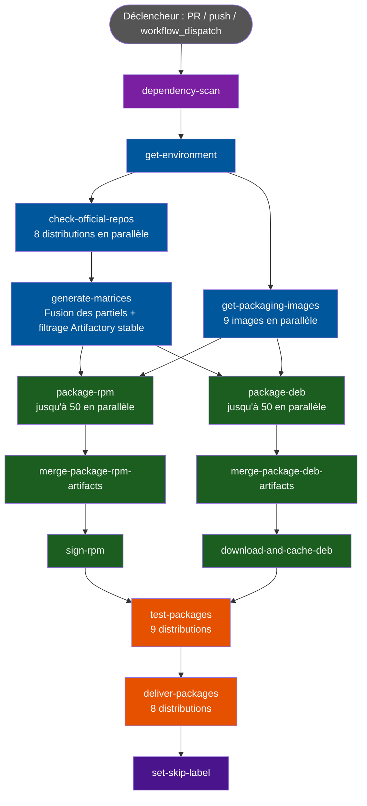
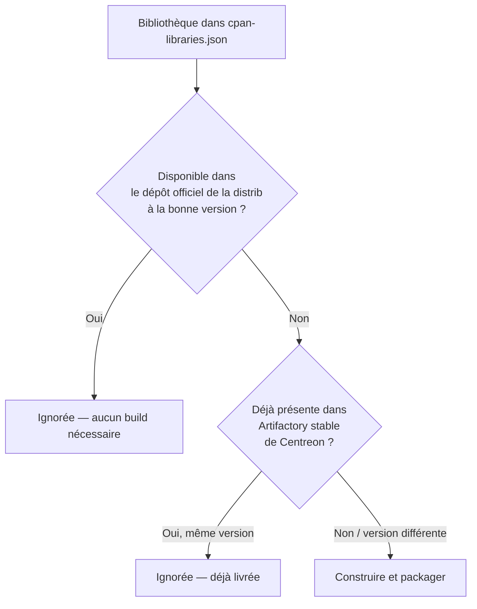

# Pipeline CI/CD des bibliothèques Perl CPAN

## Objectif

Certains modules Perl requis par les plugins ne sont pas disponibles dans les dépôts officiels des distributions Linux supportées (AlmaLinux, Debian, Ubuntu). Le workflow `perl-cpan-libraries` construit et livre ces bibliothèques manquantes sous forme de paquets natifs `.rpm` et `.deb`, afin qu'elles puissent être installées comme des paquets système standards aux côtés des plugins.

Le pipeline est **intelligent** : avant de construire quoi que ce soit, il vérifie si une bibliothèque est déjà disponible dans les dépôts officiels de la distribution ou dans le dépôt Artifactory stable de Centreon. Seules les bibliothèques véritablement absentes ou dans une mauvaise version sont packagées.

---

## Vue d'ensemble



---

## Conditions de déclenchement

| Événement | Condition | Description |
|---|---|---|
| `pull_request` | Modification de `.github/workflows/perl-cpan-libraries.yml` uniquement | Déclenché quand le workflow lui-même est modifié |
| `push` | Branches `develop`, `dev-YY.MM.x`, `master`, `YY.MM.x` + même chemin | Déclenché après la fusion d'une modification du fichier workflow |
| `workflow_dispatch` | Déclenchement manuel (aucune entrée requise) | Exécution manuelle à tout moment |

> **Important :** Contrairement au pipeline plugins, ce workflow ne se déclenche **pas** sur les modifications de `src/**`, `packaging/**` ou `tests/**`. Il ne se déclenche que si le fichier de définition du workflow lui-même change, ou lors d'un déclenchement manuel. Pour ajouter ou mettre à jour une bibliothèque, il faut modifier `cpan-libraries.json` et déclencher manuellement (ou inclure le changement du fichier workflow dans la même PR).

### Concurrence

Un seul run actif par branche ; les runs en cours sont annulés au démarrage d'un nouveau run sur la même branche.

---

## Catalogue des bibliothèques : `cpan-libraries.json`

La source de vérité unique pour toutes les bibliothèques CPAN à gérer est `.github/packaging/cpan-libraries.json`. Chaque entrée décrit un module CPAN et sa configuration de packaging :

```json
{
  "libraries": [
    {
      "name": "Crypt::OpenSSL::AES",
      "rpm": {
        "build_distribs": "el8,el9"
      },
      "deb": {
        "build_names": "bullseye-amd64,bookworm,trixie,jammy,noble,bullseye-arm64",
        "use_dh_make_perl": "false",
        "no-auto-depends": "true",
        "deb_dependencies": "libexporter-tiny-perl libxs-install-perl"
      }
    }
  ]
}
```

### Champs principaux

| Champ | Portée | Description |
|---|---|---|
| `name` | Les deux | Nom du module CPAN (ex. `Net::SNMP`) |
| `rpm.build_distribs` | RPM | Liste des distributions à cibler, séparées par des virgules. Défaut : toutes les distribs RPM (`el8,el9,el10`) |
| `rpm.version` | RPM | Épingle une version spécifique. Si absent, utilise la dernière version CPAN |
| `rpm.rpm_dependencies` | RPM | Dépendances RPM supplémentaires |
| `rpm.rpm_provides` | RPM | Entrées `Provides:` additionnelles dans le spec file |
| `rpm.no-auto-depends` | RPM | Désactive la détection automatique des dépendances |
| `rpm.preinstall_cpanlibs` | RPM | Modules CPAN à installer avant le build (ex. outils de build) |
| `rpm.preinstall_packages` | RPM | Paquets système à installer avant le build |
| `rpm.revision` | RPM | Révision du paquet (défaut : `1`) |
| `rpm.spec_file` | RPM | Chemin vers un fichier `.spec` personnalisé, contournant le script de build automatique |
| `deb.build_names` | DEB | Cibles de build séparées par des virgules. Défaut : toutes les distribs DEB |
| `deb.use_dh_make_perl` | DEB | `"true"` pour utiliser `dh-make-perl` plutôt que `fpm` |
| `deb.deb_dependencies` | DEB | Dépendances DEB supplémentaires |
| `deb.deb_provides` | DEB | Entrées `Provides:` additionnelles |
| `deb.no-auto-depends` | DEB | Désactive la détection automatique des dépendances |
| `deb.preinstall_cpanlibs` | DEB | Modules CPAN à installer avant le build |
| `deb.preinstall_packages` | DEB | Paquets système à installer avant le build |
| `deb.revision` | DEB | Révision du paquet |

Une bibliothèque avec uniquement une clé `rpm` est construite pour les distributions RPM seulement, et inversement.

---

## Filtrage intelligent

Le pipeline évite les builds inutiles grâce à un processus de filtrage en deux niveaux :



### Niveau 1 — Vérification des dépôts officiels (`check-official-repos`)

S'exécute à l'intérieur du conteneur Docker de la distribution réelle (ex. `debian:bookworm`) en utilisant le vrai gestionnaire de paquets :
- **RPM** : interroge `dnf` avec EPEL + CRB/Powertools activés
- **DEB** : interroge `apt-get` après `apt-get update`

Utilise `cpanminus` pour résoudre le nom de distribution CPAN et la version de chaque module. Produit un fichier `partial-matrix-{distrib}.json` listant uniquement les bibliothèques à construire pour cette distribution.

### Niveau 2 — Vérification de l'Artifactory stable Centreon (`generate-matrices`)

Après la collecte de tous les partiels, `generate-matrices.py` interroge en plus le dépôt Artifactory public de Centreon (`packages.centreon.com`) pour chaque bibliothèque. Si le paquet est déjà présent dans le dépôt stable à la version attendue, il est exclu de la matrice de build.

Cela évite les rebuilds redondants lors d'une re-exécution du workflow sur une branche où aucune bibliothèque n'a réellement changé.

---

## Description des jobs

### `dependency-scan`

Exécute le scan de vulnérabilités de dépendances `centreon/security-tools`.

### `get-environment`

Détermine la stabilité, la version, la release et l'état skip. Voir la [documentation CI des plugins](plugins-ci.md#get-environment) pour les détails — la logique est identique.

**Ignoré entièrement si** `stability == 'stable'` (pas de packaging sur stable).

### `check-official-repos`

S'exécute en parallèle sur 8 distributions, chacune dans l'image Docker officielle de cette distribution (ex. `almalinux:9`, `debian:bookworm`).

Pour chaque distribution :
1. Installe `python3` et `cpanminus` via le gestionnaire de paquets système.
2. Active EPEL et CRB/Powertools pour les distributions RPM.
3. Exécute `check-official-repos.py` qui :
   - Filtre le catalogue de bibliothèques pour ne garder que celles concernant cette distribution.
   - Appelle `cpanm --info` pour chaque bibliothèque afin d'obtenir le nom de distribution CPAN et la version la plus récente.
   - Interroge le gestionnaire de paquets pour vérifier si la bibliothèque (ou son équivalent packagé dans la distrib) est déjà disponible à la bonne version.
   - Produit `official-repos/partial-matrix-{distrib}.json`.
4. Uploade le partiel comme artifact GitHub Actions.

### `get-packaging-images`

En parallèle avec `check-official-repos`, tire les 9 images Docker de packaging internes depuis le registry Harbor de Centreon et les sauvegarde dans le cache GitHub Actions.

Images tirées : `packaging-plugins-alma8/9/10`, `packaging-plugins-bullseye` (amd64 + arm64), `packaging-plugins-bookworm`, `packaging-plugins-trixie`, `packaging-plugins-jammy`, `packaging-plugins-noble`.

Ces images contiennent les outils nécessaires pour construire des paquets (rpmbuild, fpm, dh-make-perl, etc.) avec tous les headers de développement requis pré-installés.

### `generate-matrices`

1. Télécharge tous les artifacts `partial-matrix-*.json`.
2. Interroge optionnellement le dépôt Artifactory stable de Centreon pour exclure les paquets déjà livrés.
3. Génère deux matrices plates (sans produit croisé, `include` uniquement) :
   - `matrix_rpm` : une entrée par combinaison (bibliothèque, distribution RPM) à construire
   - `matrix_deb` : une entrée par combinaison (bibliothèque, cible DEB) à construire
4. Supprime les artifacts de matrices partielles (nettoyage).

Chaque entrée de matrice porte tous les paramètres nécessaires au build : `name`, `distrib`, `image`, `version`, `rpm_dependencies`, `deb_dependencies`, `use_dh_make_perl`, etc.

### `package-rpm`

Construit les paquets RPM. Jusqu'à 50 jobs s'exécutent en parallèle, un par entrée (bibliothèque, distrib) de `matrix_rpm`.

Pour chaque entrée, à l'intérieur du conteneur Docker de packaging :

**Mode standard** (pas de `spec_file`) : exécute `package-cpan-rpm.sh` qui :
1. Installe optionnellement les modules CPAN pré-requis (`preinstall_cpanlibs`) et les paquets système.
2. Télécharge et construit le module depuis CPAN avec `cpanm`.
3. Package le résultat en RPM avec `cpanspec` et `rpmbuild`.

**Mode spec file personnalisé** (`spec_file` défini) : exécute `rpmbuild` directement avec le fichier spec fourni (pour les bibliothèques nécessitant des étapes de build complexes).

Sortie : un fichier `.rpm` par entrée, uploadé comme artifact individuel.

### `merge-package-rpm-artifacts`

Fusionne tous les artifacts RPM individuels en un artifact par distribution (`packages-rpm-el8`, `packages-rpm-el9`, `packages-rpm-el10`) pour faciliter la consommation en aval, puis supprime les artifacts individuels.

### `sign-rpm`

Signe tous les fichiers `.rpm` pour chaque distribution avec la clé GPG de signature de Centreon. S'exécute séquentiellement (max-parallel: 1) dans un conteneur de signature dédié.

Sauvegarde les RPMs signés dans le cache avec la clé `{sha}-{run_id}-rpm-{distrib}`.

### `package-deb`

Construit les paquets DEB. Jusqu'à 50 jobs s'exécutent en parallèle, un par entrée (bibliothèque, cible DEB) de `matrix_deb`. Supporte deux méthodes de packaging :

**Méthode 1 — fpm** (`use_dh_make_perl: "false"`, défaut) :
Exécute `package-cpan-deb-fpm.sh` qui installe le module via `cpanm` puis le repackage en `.deb` avec `fpm`. Donne un contrôle total sur les dépendances (`deb_dependencies`) et les métadonnées.

**Méthode 2 — dh-make-perl** (`use_dh_make_perl: "true"`) :
Exécute `package-cpan-deb-dhmaker.sh` qui utilise `dh-make-perl` pour générer automatiquement un paquet Debian correct suivant les conventions de packaging Debian. Utilisé pour les bibliothèques nécessitant un packaging au format strict Debian.

Sortie : un fichier `.deb` par entrée, uploadé comme artifact individuel.

### `merge-package-deb-artifacts`

Identique à l'équivalent RPM : fusionne les artifacts DEB individuels en un artifact par distribution, puis supprime les artifacts individuels.

### `download-and-cache-deb`

Télécharge les artifacts DEB fusionnés et les sauvegarde dans le cache GitHub Actions avec la clé `{sha}-{run_id}-deb-{distrib}`.

### `test-packages`

Installe et teste toutes les bibliothèques packagées sur les 9 distributions supportées (en utilisant les images officielles, pas les images internes). S'exécute en matrice sur :

| Distribution | Format | Architecture |
|---|---|---|
| el8 | RPM | amd64 |
| el9 | RPM | amd64 |
| el10 | RPM | amd64 |
| bullseye | DEB | amd64 + arm64 |
| bookworm | DEB | amd64 |
| trixie | DEB | amd64 |
| jammy | DEB | amd64 |
| noble | DEB | amd64 |

Utilise l'action `.github/actions/test-cpan-libs`, qui installe tous les paquets pour la distribution et vérifie qu'ils se chargent correctement via `perl -e "use Module::Name"`.

En cas d'échec, un artifact de log d'erreur est uploadé sous le nom `install_error_log_{distrib}-{arch}`.

### `deliver-packages`

Uploade tous les paquets vers le dépôt Artifactory de Centreon sous le module `perl-cpan-libraries`.

**Conditions :**
- `stability` est `testing` ou `unstable`, **OU** `stability == 'stable'` avec un événement `push` (pas `workflow_dispatch`)
- Tous les jobs précédents ont réussi

### `set-skip-label`

Ajoute le label `skip-workflow-perl-cpan-libraries` à la PR après une livraison réussie, pour éviter de relancer si aucun changement pertinent n'est détecté lors du prochain push.

---

## Résumé de l'utilisation du cache

| Clé | Contenu | Produit par | Consommé par |
|---|---|---|---|
| `{image}-{sha}-{run_id}` | Archive tar de l'image Docker | `get-packaging-images` | `package-rpm`, `package-deb` |
| `{sha}-{run_id}-rpm-{distrib}` | Fichiers `.rpm` signés | `sign-rpm` | `test-packages`, `deliver-packages` |
| `{sha}-{run_id}-deb-{distrib}` | Fichiers `.deb` | `download-and-cache-deb` | `test-packages`, `deliver-packages` |

---

## Distributions supportées

| Distribution | OS | Format | Construit par |
|---|---|---|---|
| el8 | AlmaLinux 8 | RPM | `package-rpm` |
| el9 | AlmaLinux 9 | RPM | `package-rpm` |
| el10 | AlmaLinux 10 | RPM | `package-rpm` |
| bullseye (amd64) | Debian 11 | DEB | `package-deb` |
| bullseye (arm64) | Debian 11 | DEB | `package-deb` |
| bookworm | Debian 12 | DEB | `package-deb` |
| trixie | Debian 13 | DEB | `package-deb` |
| jammy | Ubuntu 22.04 | DEB | `package-deb` |
| noble | Ubuntu 24.04 | DEB | `package-deb` |

---

## Ajouter une nouvelle bibliothèque CPAN

1. Éditer `.github/packaging/cpan-libraries.json` et ajouter une nouvelle entrée :
   ```json
   {
     "name": "My::New::Module",
     "rpm": {},
     "deb": {}
   }
   ```
   Des objets `rpm` et `deb` vides utilisent toutes les valeurs par défaut (build pour toutes les distributions, dernière version CPAN, détection automatique des dépendances).

2. Déclencher le workflow manuellement via `workflow_dispatch`, ou inclure le changement de `cpan-libraries.json` dans une PR qui modifie aussi le fichier workflow.

3. La CI vérifiera d'abord les dépôts officiels. Si le module est déjà packagé là, rien ne sera construit et le workflow se termine avec succès.

4. Si le module est absent des dépôts officiels, il sera automatiquement packagé, testé et livré.

> **Astuce :** Pour les modules complexes (extensions XS/C, systèmes de build inhabituels), utiliser `preinstall_cpanlibs`, `preinstall_packages`, ou fournir un `spec_file` personnalisé. Se référer aux entrées existantes dans `cpan-libraries.json` pour des exemples.

---

## Différences clés avec le pipeline plugins

| Aspect | `plugins.yml` | `perl-cpan-libraries.yml` |
|---|---|---|
| Chemins déclencheurs | `src/**`, `packaging/**`, `tests/**` | `.github/workflows/perl-cpan-libraries.yml` uniquement |
| Détection des changements | Par plugin (`plugins.json`) | Globale (toutes les bibliothèques réévaluées) |
| Filtrage du build | Tous les plugins modifiés | Vérification dépôts officiels + Artifactory stable |
| Outil de packaging | App::FatPacker + nfpm | cpanm + rpmbuild/fpm/dh-make-perl |
| Signature DEB | Via nfpm | Non signés (les paquets DEB ne sont pas signés GPG) |
| Signature RPM | Via nfpm | Job dédié `sign-rpm` |
| Méthode de test | Installation + Robot Framework / `--help` | Installation + `perl -e "use Module"` |
