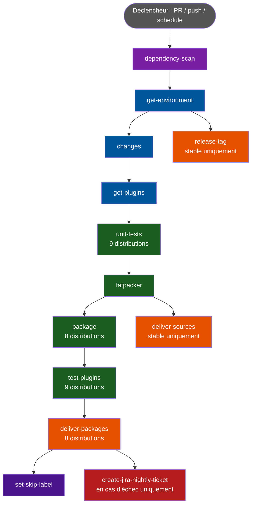
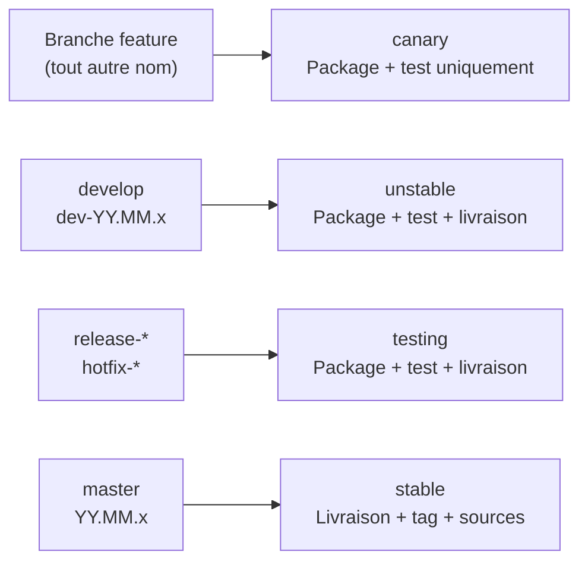
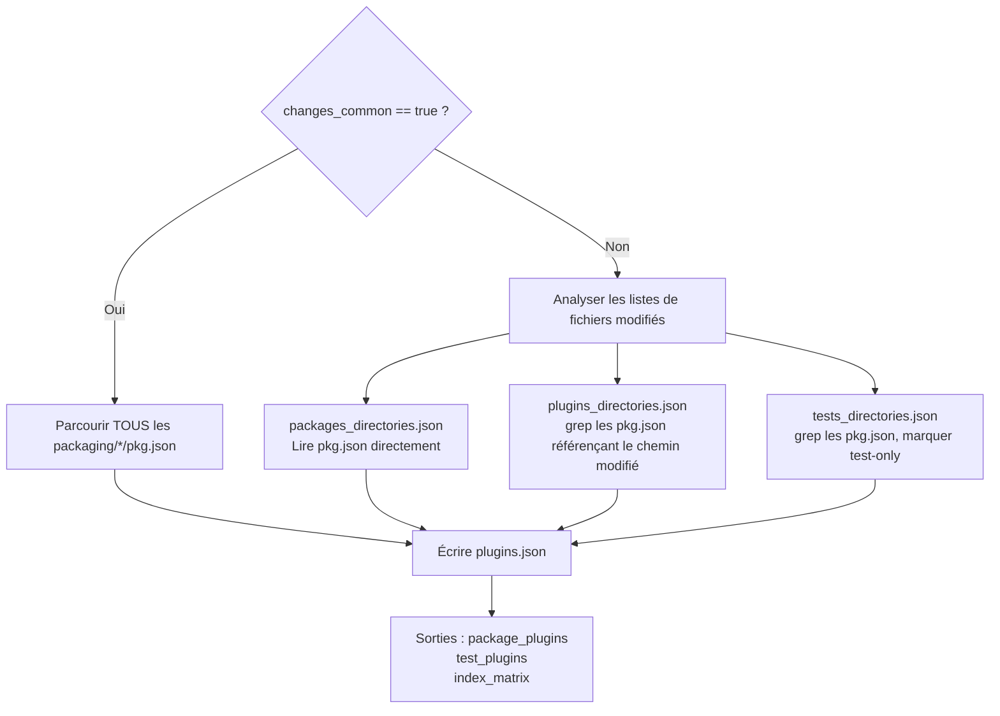
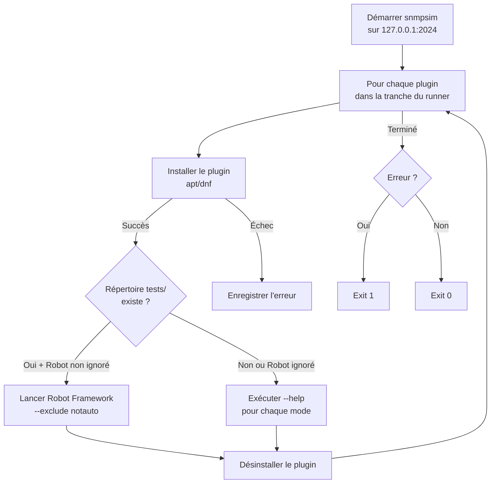
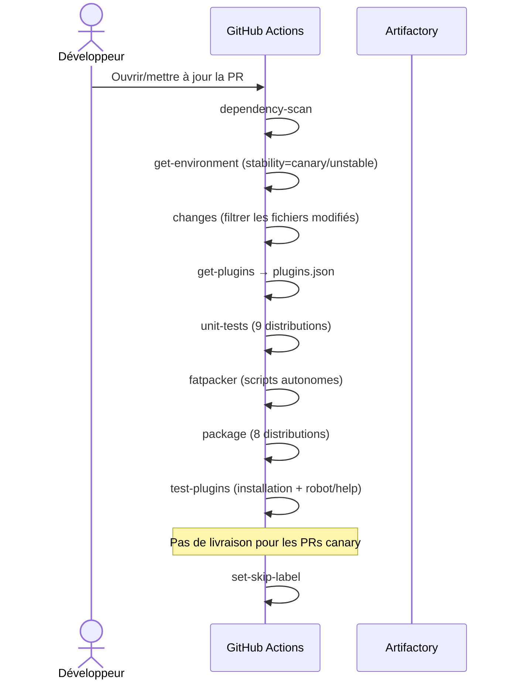
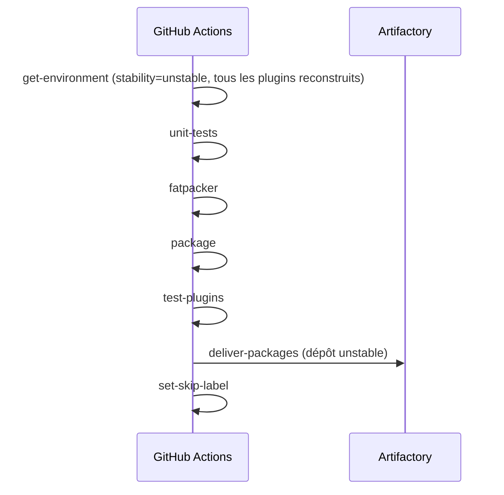
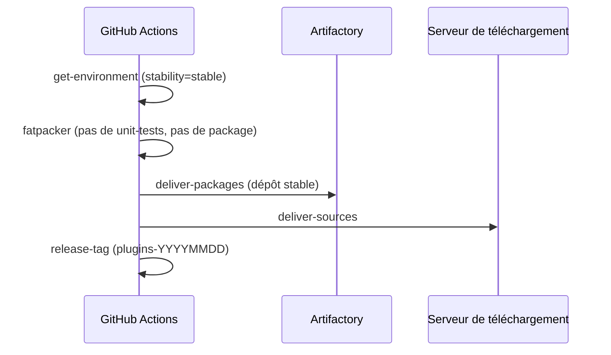

# Pipeline CI/CD des plugins

## Vue d'ensemble

Le pipeline CI/CD des plugins est défini dans `.github/workflows/plugins.yml`. Il automatise l'intégralité du cycle de vie d'une modification de plugin : détection des changements, tests unitaires, packaging, tests d'intégration et livraison sur les dépôts Centreon.



---

## Conditions de déclenchement

Le pipeline se déclenche dans les cas suivants :

| Événement | Condition | Description |
|---|---|---|
| `pull_request` | Fichiers correspondant au filtre de chemins (voir ci-dessous) | Déclenché sur toute PR modifiant des fichiers concernés |
| `push` | Branches `develop` ou `master` + chemins correspondants | Déclenché après la fusion d'une PR vers `develop` ou `master` |
| `schedule` | Tous les lundis à 01h30 UTC (`30 1 * * 1`) | Run nightly hebdomadaire |
| `workflow_dispatch` | Déclenchement manuel avec `nightly_manual_trigger = true` | Run nightly manuel |

### Filtre de chemins

La CI ne se déclenche que si au moins l'un des chemins suivants est modifié :

```
.github/workflows/plugins.yml
.github/workflows/plugins-robot-tests.yml
.github/scripts/list-plugins-to-build-and-test.py
.github/scripts/prepare-package-plugins.sh
.github/scripts/fatpack-plugins.pl
.github/scripts/test-plugins.py
.github/packaging/centreon-plugin.yaml.template
src/**
packaging/**
tests/**
```

### Concurrence

Un seul run est actif par branche à la fois. Si un nouveau run démarre sur la même branche, le run en cours est automatiquement annulé (`cancel-in-progress: true`).

---

## Niveaux de stabilité

Le nom de la branche détermine le niveau de stabilité, qui conditionne les actions effectuées :



| Stabilité | Branches | Format de version | Paquet livré |
|---|---|---|---|
| `canary` | Toute branche feature | `YYYYMM00` | Non |
| `unstable` | `develop`, `dev-YY.MM.x` | `YYYYMMDD` (date du jour) | Oui (dépôt unstable) |
| `testing` | `release-YYYYMMDD`, `hotfix-YYYYMMDD` | Date extraite du nom de branche | Oui (dépôt testing) |
| `stable` | `master`, `YY.MM.x` | Depuis le fichier `.version.plugins` | Oui (dépôt stable) |

---

## Mécanisme skip-workflow

Une PR peut porter le label `skip-workflow-plugins`. Lorsque ce label est présent :

1. `get-environment` vérifie si le dernier push a modifié des fichiers concernés par la CI.
2. Si aucun fichier pertinent n'a changé, `skip_workflow=true` est défini et l'intégralité du pipeline s'arrête immédiatement.
3. Si des fichiers pertinents sont détectés, le label est automatiquement retiré et le pipeline continue normalement.

Ce mécanisme permet à une PR d'éviter des re-runs inutiles lorsque seuls des changements non fonctionnels (documentation, etc.) sont poussés.

---

## Description des jobs

### `dependency-scan`

Exécute un workflow de sécurité externe (`centreon/security-tools`) pour analyser les dépendances du projet à la recherche de vulnérabilités connues.

### `get-environment`

Détermine le contexte de build pour le run en cours. Les sorties sont utilisées par tous les jobs en aval :

| Sortie | Description |
|---|---|
| `version` | Version du paquet (`YYYYMMDD` pour unstable, date issue de la branche pour testing, depuis `.version.plugins` pour stable) |
| `release` | Release du paquet (`1` pour testing/unstable, timestamp Unix pour les autres) |
| `stability` | `canary`, `unstable`, `testing` ou `stable` |
| `is_nightly` | `true` quand déclenché par schedule ou dispatch nightly manuel |
| `skip_workflow` | `true` quand le label skip est présent et qu'aucun fichier pertinent n'a changé |

### `changes`

Actif uniquement sur les pull requests ciblant des branches de stabilité `testing`, `unstable` ou `canary`.

Utilise `dorny/paths-filter` pour identifier les catégories de fichiers modifiés :

- `common` : modifications dans `src/centreon/**` ou le template de packaging
- `packages` : fichiers nouveaux ou modifiés dans `packaging/**`
- `plugins` : fichiers nouveaux ou modifiés dans `src/**`
- `tests` : fichiers nouveaux ou modifiés dans `tests/**`

> **Note :** Sur les événements `push` (fusions vers `develop`/`master`), `changes_common` vaut `true` par défaut, ce qui entraîne la reconstruction de tous les plugins.

### `get-plugins`

Détermine la liste des plugins à builder et/ou tester, et l'écrit dans `plugins.json`.



Chaque entrée dans `plugins.json` contient :

```json
{
  "centreon-plugin-Network-Foo-Bar": {
    "perl_package": "network::foo::bar::snmp::plugin",
    "command": "centreon_foo_bar_snmp.pl",
    "paths": ["network/foo/bar/snmp"],
    "build": true,
    "test": true,
    "runner_id": 3,
    "test_dependencies": []
  }
}
```

Le champ `runner_id` distribue les plugins sur 25 runners de test parallèles au maximum (`max_testing_jobs`).

Le fichier `plugins.json` produit est sauvegardé dans le cache GitHub Actions avec la clé `plugins-{sha}-{run_id}`.

> **Astuce :** Ajoutez le label `upload-artifacts` à une PR pour récupérer `plugins.json` en tant qu'artifact téléchargeable.

### `unit-tests`

Exécute les tests unitaires Perl sur toutes les distributions supportées en parallèle (3 au maximum simultanément).

**Ignoré si :** `stability == 'stable'`

| Image | Distribution | Architecture |
|---|---|---|
| `unit-tests-alma8` | el8 (AlmaLinux 8) | amd64 |
| `unit-tests-alma9` | el9 (AlmaLinux 9) | amd64 |
| `unit-tests-alma10` | el10 (AlmaLinux 10) | amd64 |
| `unit-tests-bullseye` | Debian 11 | amd64 |
| `unit-tests-bullseye-arm64` | Debian 11 | arm64 |
| `unit-tests-bookworm` | Debian 12 | amd64 |
| `unit-tests-trixie` | Debian 13 | amd64 |
| `unit-tests-jammy` | Ubuntu 22.04 | amd64 |
| `unit-tests-noble` | Ubuntu 24.04 | amd64 |

En cas d'échec, le fichier `lastlog.jsonl` est uploadé comme artifact.

### `fatpacker`

Produit des scripts Perl autonomes (un par plugin) en regroupant toutes les dépendances dans un fichier exécutable unique grâce à [App::FatPacker](https://metacpan.org/pod/App::FatPacker).

**Requiert :** `package_plugins == 'True'` (au moins un plugin à builder)

Étapes :
1. Restaure `plugins.json` depuis le cache.
2. Positionne les drapeaux `$global_version` et `$alternative_fatpacker` dans `src/centreon/plugins/script.pm`.
3. Pour chaque plugin dans `plugins.json` avec `build == true` :
   - Copie les fichiers du framework commun + les fichiers spécifiques au plugin dans un répertoire `lib/`.
   - Supprime les blocs `__END__` (compatibilité Centreon Connector Perl).
   - Exécute `App::FatPacker->fatpack_file("centreon_plugins.pl")`.
   - Produit un exécutable autonome dans `build/<nom_plugin>/<commande_plugin>`.
4. Sauvegarde le répertoire `build/` dans le cache avec la clé `fatpacked-plugins-{sha}-{run_id}`.

### `package`

Construit les paquets `.rpm` et `.deb` pour toutes les distributions supportées (5 au maximum en parallèle).

**Ignoré si :** `stability == 'stable'`

Utilise des images Docker internes depuis le registry Harbor de Centreon. Pour chaque distribution :
1. Restaure `build/` (plugins fatpackés) et `plugins.json` depuis le cache.
2. Exécute `prepare-package-plugins.sh` pour générer les descripteurs YAML compatibles `nfpm` depuis le template.
3. Exécute l'action `package-nfpm` pour construire et signer les paquets (GPG pour RPM).
4. Sauvegarde les paquets dans le cache avec la clé `{sha}-{run_id}-{extension}-{distrib}`.

Distributions supportées :

| Distribution | Format |
|---|---|
| el8 | RPM |
| el9 | RPM |
| el10 | RPM |
| bullseye | DEB |
| bookworm | DEB |
| trixie | DEB |
| jammy | DEB |
| noble | DEB |

### `test-plugins`

Installe, teste et désinstalle chaque plugin sur toutes les distributions supportées. Ce job appelle le workflow réutilisable `.github/workflows/plugins-robot-tests.yml`.

**Ignoré si :** `stability == 'stable'` ou `test_plugins != 'True'`

La matrice de test est identique à celle du packaging, plus `bullseye-arm64`. Jusqu'à 25 runners sont utilisés en parallèle (contrôlé par `index_matrix`).

Pour chaque combinaison runner/distribution :
1. L'image Docker est tirée et mise en cache.
2. Les paquets et `plugins.json` sont restaurés depuis le cache.
3. `test-plugins.py` est exécuté dans le conteneur :



> **Note :** Pour `el10` et `trixie`, les tests Robot Framework sont ignorés (`skip_robot_tests: true`) et seule la vérification `--help` est effectuée. C'est temporaire, le temps que le support Robot Framework soit ajouté pour ces distributions.

En cas d'échec, les logs et rapports Robot sont uploadés comme artifacts nommés `test-plugins-log-{distrib}-{arch}-{index}`.

### `deliver-packages`

Envoie les paquets vers le dépôt Artifactory de Centreon.

**Conditions :**
- `package_plugins == 'True'`
- `stability` est `testing` ou `unstable`, **OU** `stability == 'stable'` avec un événement `push` (pas `workflow_dispatch`)

Utilise l'action `package-delivery` avec le module `plugins` pour chaque distribution.

### `deliver-sources`

Envoie les fichiers de plugins fatpackés vers le serveur de téléchargement Centreon.

**Conditions :** `stability == 'stable'` ET événement `push`

### `release-tag`

Crée un tag Git au format `plugins-YYYYMMDD`.

**Conditions :** `stability == 'stable'` ET événement `push`

Si le tag existe déjà, un avertissement est émis mais le job ne échoue pas.

### `set-skip-label`

Après une livraison réussie, ajoute le label `skip-workflow-plugins` à la PR. Cela évite de relancer le pipeline complet si aucun fichier pertinent ne change lors du prochain push sur la même PR.

### `create-jira-nightly-ticket`

Crée automatiquement un ticket Jira si un run nightly échoue (`is_nightly == 'true'` et premier essai uniquement).

---

## Résumé de l'utilisation du cache

| Clé | Contenu | Produit par | Consommé par |
|---|---|---|---|
| `plugins-{sha}-{run_id}` | `plugins.json` | `get-plugins` | `fatpacker`, `package`, `test-plugins` |
| `fatpacked-plugins-{sha}-{run_id}` | Répertoire `build/` | `fatpacker` | `package`, `deliver-sources` |
| `{sha}-{run_id}-{ext}-{distrib}` | Fichiers `.rpm` / `.deb` | `package` | `test-plugins`, `deliver-packages` |
| `{image}-{sha}-{run_id}` | Archive tar de l'image Docker | `test-image-to-cache` | `robot-test` |

---

## Tableau récapitulatif des distributions

| Distribution | OS | Format | Tests unitaires | Packaging | Tests | Tests Robot |
|---|---|---|---|---|---|---|
| el8 | AlmaLinux 8 | RPM | Oui | Oui | Oui | Oui |
| el9 | AlmaLinux 9 | RPM | Oui | Oui | Oui | Oui |
| el10 | AlmaLinux 10 | RPM | Oui | Oui | Oui | Non (--help seulement) |
| bullseye | Debian 11 | DEB | Oui (amd64 + arm64) | Oui | Oui (amd64 + arm64) | Oui |
| bookworm | Debian 12 | DEB | Oui | Oui | Oui | Oui |
| trixie | Debian 13 | DEB | Oui | Oui | Oui | Non (--help seulement) |
| jammy | Ubuntu 22.04 | DEB | Oui | Oui | Oui | Oui |
| noble | Ubuntu 24.04 | DEB | Oui | Oui | Oui | Oui |

---

## Flux complet du pipeline par type d'événement

### Pull request vers `develop` (stabilité canary/unstable)



### Push vers `develop` (stabilité unstable)



### Push vers `master` (stabilité stable)



---

## Ajouter un nouveau plugin dans la CI

Pour inclure un nouveau plugin dans le pipeline CI :

1. Créer le répertoire de packaging : `packaging/centreon-plugin-<Nom>/`
2. Créer `pkg.json` avec les métadonnées du plugin et la liste des fichiers.
3. Créer `rpm.json` et `deb.json` avec les listes de dépendances Perl.
4. Ajouter les fichiers de tests Robot Framework sous `tests/<domaine>/<vendeur>/...`

Lors de la prochaine PR ou du prochain push, la CI détectera automatiquement le nouveau `pkg.json` et inclura le plugin dans le cycle de build et de test.

Voir `doc/CI.md` pour les instructions détaillées sur le format des fichiers de packaging.
