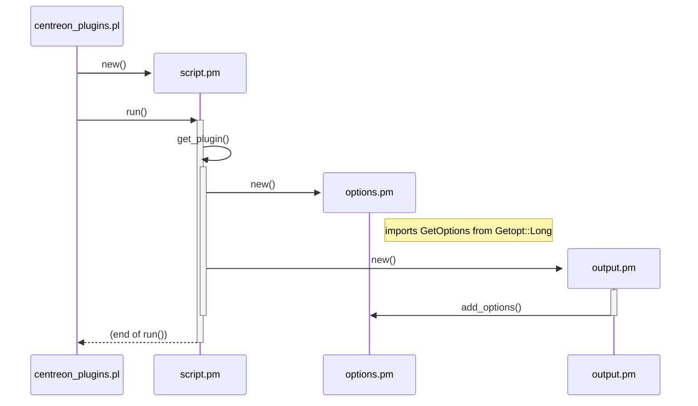

# Comparatif PlantUML vs Mermaid

## Diagrammes de séquences

### Extrait tout simple du diagramme des plugins

```plantuml
participant centreon_plugins.pl
create participant script.pm
centreon_plugins.pl ->  script.pm       :   new()
centreon_plugins.pl ->  script.pm       :   run()
activate script.pm
script.pm           ->  script.pm       :   get_plugin()
note right: lasts the next n calls
create participant options.pm
script.pm           ->  options.pm      :   new()
note right: imports GetOptions from Getopt::Long
create participant output.pm
script.pm           ->  output.pm       :   new()
output.pm           ->  options.pm      :   add_options()
note left: adds options for output and perfdata
```



